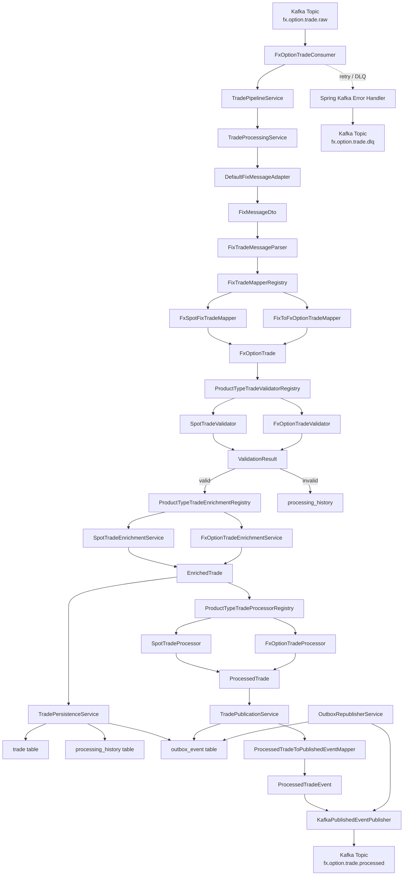
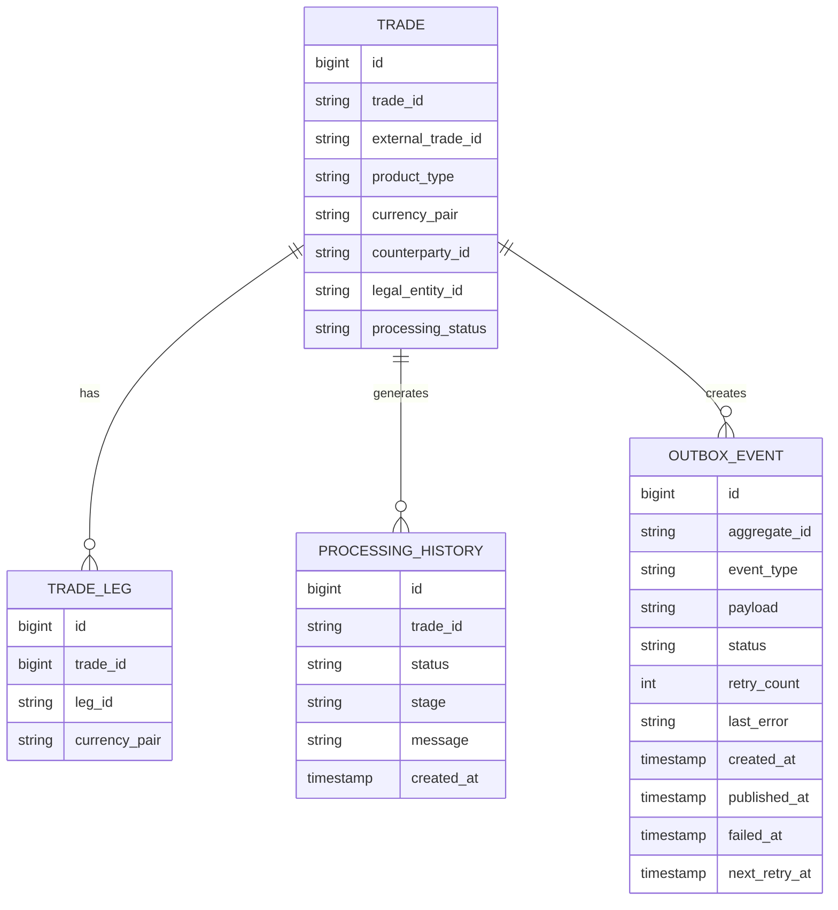
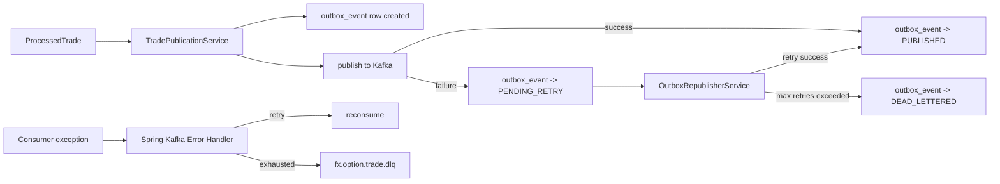

# ARCHITECTURE

This document explains the current runtime flow, core object relationships, persistence model, and reliability behavior of the `fidstp2` system.

## 1) End-to-end runtime flow



## 2) Simplest mental model

```text
Raw FIX message
  -> split into FIX tags
  -> choose mapper by product type
  -> build trade object
  -> choose validator by product type
  -> choose enrichment strategy by product type
  -> persist + append audit history
  -> choose processor by product type
  -> publish downstream through outbox
  -> retry / DLQ if needed
```

## 3) Main object and service relationships

```mermaid
classDiagram
    class FxOptionTradeConsumer {
      +onMessage(rawMessage)
    }

    class TradePipelineService {
      -TradeProcessingService processingService
      -TradePublicationService publicationService
      +handleRawMessage(rawMessage)
    }

    class TradeProcessingService {
      -TradeMessageParser~FxOptionTrade~ parser
      -ProductTypeTradeValidatorRegistry validatorRegistry
      -ProductTypeTradeEnrichmentRegistry enrichmentRegistry
      -ProductTypeTradeProcessorRegistry processorRegistry
      -TradePersistenceService persistenceService
      +processRawMessage(rawMessage) ProcessedTrade
    }

    class FixTradeMessageParser {
      -FixMessageAdapter adapter
      -FixTradeMapperRegistry~FxOptionTrade~ mapperRegistry
      +parse(rawMessage) FxOptionTrade
    }

    class DefaultFixMessageAdapter {
      +adapt(rawMessage) FixMessageDto
    }

    class FixTradeMapperRegistry~T~ {
      -List~FixProductTradeMapper~ mappers
      +map(fixMessage) T
    }

    class FixProductTradeMapper~T~ {
      <<interface>>
      +supports(productType) boolean
      +map(fixMessage) T
    }

    class FxSpotFixTradeMapper
    class FixToFxOptionTradeMapper

    class ProductTypeTradeValidatorRegistry {
      -List~ProductTypeTradeValidator~ validators
      +validate(trade) ValidationResult
    }

    class ProductTypeTradeValidator {
      <<interface>>
      +supports(productType) boolean
      +validate(trade) ValidationResult
    }

    class SpotTradeValidator
    class FxOptionTradeValidator

    class ProductTypeTradeEnrichmentRegistry {
      -List~ProductTypeTradeEnrichmentService~ services
      +enrich(trade) EnrichedTrade
    }

    class ProductTypeTradeEnrichmentService {
      <<interface>>
      +supports(productType) boolean
      +enrich(trade) EnrichedTrade
    }

    class SpotTradeEnrichmentService
    class FxOptionTradeEnrichmentService

    class ProductTypeTradeProcessorRegistry {
      -List~ProductTypeTradeProcessor~ processors
      +process(enrichedTrade) ProcessedTrade
    }

    class ProductTypeTradeProcessor {
      <<interface>>
      +supports(productType) boolean
      +process(enrichedTrade) ProcessedTrade
    }

    class SpotTradeProcessor
    class FxOptionTradeProcessor

    class TradePersistenceService {
      +upsertTrade(enrichedTrade)
      +appendProcessingHistory(...)
      +createOutboxEvent(...)
      +markOutboxEventPublished(...)
      +markOutboxEventForRetry(...)
    }

    class TradePublicationService {
      -TradePersistenceService persistenceService
      -PublishedEventPublisher publisher
      -ProcessedTradeToPublishedEventMapper mapper
      +publish(processedTrade)
    }

    class ProcessedTradeToPublishedEventMapper {
      +map(processedTrade) ProcessedTradeEvent
    }

    class KafkaPublishedEventPublisher {
      +publish(key, payload)
    }

    class FxOptionTrade
    class EnrichedTrade
    class ProcessedTrade
    class ProcessedTradeEvent
    class ValidationResult

    FxOptionTradeConsumer --> TradePipelineService
    TradePipelineService --> TradeProcessingService
    TradePipelineService --> TradePublicationService

    TradeProcessingService --> FixTradeMessageParser
    TradeProcessingService --> ProductTypeTradeValidatorRegistry
    TradeProcessingService --> ProductTypeTradeEnrichmentRegistry
    TradeProcessingService --> ProductTypeTradeProcessorRegistry
    TradeProcessingService --> TradePersistenceService

    FixTradeMessageParser --> DefaultFixMessageAdapter
    FixTradeMessageParser --> FixTradeMapperRegistry
    FixTradeMapperRegistry --> FixProductTradeMapper
    FxSpotFixTradeMapper ..|> FixProductTradeMapper
    FixToFxOptionTradeMapper ..|> FixProductTradeMapper

    ProductTypeTradeValidatorRegistry --> ProductTypeTradeValidator
    SpotTradeValidator ..|> ProductTypeTradeValidator
    FxOptionTradeValidator ..|> ProductTypeTradeValidator

    ProductTypeTradeEnrichmentRegistry --> ProductTypeTradeEnrichmentService
    SpotTradeEnrichmentService ..|> ProductTypeTradeEnrichmentService
    FxOptionTradeEnrichmentService ..|> ProductTypeTradeEnrichmentService

    ProductTypeTradeProcessorRegistry --> ProductTypeTradeProcessor
    SpotTradeProcessor ..|> ProductTypeTradeProcessor
    FxOptionTradeProcessor ..|> ProductTypeTradeProcessor

    FixTradeMessageParser --> FxOptionTrade
    ProductTypeTradeEnrichmentRegistry --> EnrichedTrade
    ProductTypeTradeProcessorRegistry --> ProcessedTrade
    TradePublicationService --> ProcessedTradeEvent
    TradePublicationService --> KafkaPublishedEventPublisher
```



## 4) What each important object means

### Input and parsing layer

- **`FxOptionTradeConsumer`**
  - Kafka listener for raw inbound messages.
- **`DefaultFixMessageAdapter`**
  - Converts raw FIX-like text into a `FixMessageDto` tag map.
  - Supports both `|` and SOH (`\u0001`) delimiters.
- **`FixTradeMessageParser`**
  - Orchestrates raw message -> adapter -> mapper registry.
- **`FixTradeMapperRegistry`**
  - Chooses which product mapper should handle the message based on FIX tag `20000`.
- **`FxSpotFixTradeMapper` / `FixToFxOptionTradeMapper`**
  - Product-type strategies for mapping FIX data into a domain trade object.

### Domain and business layer

- **`FxOptionTrade`**
  - Current in-memory trade object flowing through the pipeline.
- **`EnrichedTrade`**
  - Wraps the trade plus reference data:
    - counterparty
    - currency pair
    - legal entity
    - settlement instruction
- **`ProcessedTrade`**
  - Internal processing result used for persistence status and publication.
- **`ProcessedTradeEvent`**
  - Serialized downstream event pushed to Kafka.

### Strategy routing layer

- **`ProductTypeTradeValidatorRegistry`**
  - Chooses the validator strategy for the product type.
- **`ProductTypeTradeEnrichmentRegistry`**
  - Chooses the enrichment strategy for the product type.
- **`ProductTypeTradeProcessorRegistry`**
  - Chooses the processing strategy for the product type.

This means product-specific behavior is no longer hardcoded in one place. New product types can be added by plugging in strategies.

## 5) Persistence model



### Table responsibilities

- **`trade`**
  - Main persisted business record.
- **`trade_leg`**
  - Stores option leg data where relevant.
- **`processing_history`**
  - Audit trail of validation, processing, and publication status changes.
- **`outbox_event`**
  - Outbox handoff state for downstream publication.
  - Tracks retries, last error, and dead-letter state.

## 6) Reliability behavior



### What that means operationally

- Inbound consumer failures are retried by Spring Kafka.
- Exhausted consumer failures are sent to `fx.option.trade.dlq`.
- Outbound publish failures are persisted in `outbox_event` and retried by `OutboxRepublisherService`.
- Dead-letter state is tracked in the database when retry exhaustion happens on publication.

## 7) Product-type extension model

Current routing order is intentionally explicit:

1. Parse product type from FIX tag `20000`
2. Route to the first supporting mapper
3. Route to the first supporting validator
4. Route to the first supporting enrichment strategy
5. Route to the first supporting processor

That means the path for a new product type is:

- add a mapper strategy
- add a validator strategy
- add an enrichment strategy
- add a processor strategy
- register them before the generic/fallback strategies

## 8) Important current-state note

The architecture now supports multi-product strategy routing, but the implementation is still transitional:

- `SPOT` has its own mapper, validator, enrichment, and processor strategy classes
- those strategies currently reuse the existing `FxOptionTrade`-shaped object model and delegated downstream logic
- this is a safe incremental step toward true product-specific domain semantics

So the framework for multi-product expansion is now in place, but true non-option product modeling is still a next phase item.
