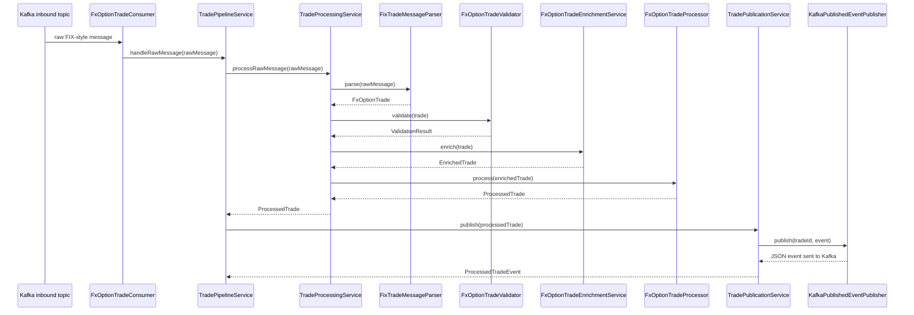

# FIDSTP2

FIDSTP2 is a Spring Boot service for **post-trade FX options processing**. It consumes raw FIX-style trade messages, parses them into domain objects, validates the content, enriches the trade with reference data, produces a processed event, and persists supporting lifecycle data through JPA/Flyway-backed tables.

This repository already contains the core pipeline building blocks and automated tests. It also includes roadmap documents for the remaining production-hardening work.

## Table of Contents

- [What the service does](#what-the-service-does)
- [Current implementation status](#current-implementation-status)
- [Architecture overview](#architecture-overview)
- [Sequence diagram](#sequence-diagram)
- [Project structure](#project-structure)
- [Technology stack](#technology-stack)
- [Prerequisites](#prerequisites)
- [Getting started](#getting-started)
- [Docker local infrastructure](#docker-local-infrastructure)
- [Configuration](#configuration)
- [Inbound message format](#inbound-message-format)
- [Database and migrations](#database-and-migrations)
- [Kafka topics](#kafka-topics)
- [How to verify persistence after processing](#how-to-verify-persistence-after-processing)
- [End-to-end local walkthrough](#end-to-end-local-walkthrough)
- [Testing](#testing)
- [Roadmap and supporting docs](#roadmap-and-supporting-docs)
- [Known limitations / next steps](#known-limitations--next-steps)

## What the service does

At a high level, the application processes FX option trades like this:

1. Receive a raw FIX-style message from Kafka.
2. Adapt FIX tags into a tag map.
3. Map the tag map into an `FxOptionTrade` domain object.
4. Validate required fields and cross-field rules.
5. Enrich the trade with counterparty, currency-pair, legal-entity, and settlement reference data.
6. Produce a `ProcessedTrade` result.
7. Map the result to a `ProcessedTradeEvent` and publish it to Kafka.
8. Persist trade/outbox/history data via JPA repositories and Flyway-managed tables.

## Current implementation status

### Implemented in the codebase

- Spring Boot application bootstrap in `src/main/java/org/example/fidstp2/Fidstp2Application.java`
- Pipeline wiring in `src/main/java/org/example/fidstp2/config/PipelineConfiguration.java`
- FIX adaptation and parsing
- FX option validation rules
- In-memory enrichment services
- Trade processing and publication services
- Kafka consumer and Kafka publisher abstractions
- JPA entities and repositories for trades, trade legs, processing history, and outbox events
- Flyway migration files in `src/main/resources/db/migration`
- Unit and integration-style test coverage across parser, validator, mapper, processor, publisher, service, consumer, and persistence flows

### Planned / documented but not fully delivered yet

The repository also contains a broader roadmap for operational features such as:

- richer persistence orchestration and idempotency behavior
- retry / DLQ / replay operations
- REST APIs for trade lookup and replay
- production observability and hardening

See `IMPLEMENTATION_PHASES.md` and `HELP.md` for the full target scope.

## Architecture overview

### Microservices architecture

The system now supports a **microservices deployment model**:

- **Main app (FIDSTP2)** runs on port `8080` with Kafka and main PostgreSQL database.
- **Counterparty Service** runs independently on port `8888` with its own PostgreSQL database.
- Services communicate via HTTP REST APIs (configurable local or remote).
- Both services are containerized and orchestrated via Docker Compose.

**Configuration:**
- Set `ENRICHMENT_COUNTERPARTY_REMOTE_ENABLED=true` (env var) to enable remote service.
- Set `ENRICHMENT_COUNTERPARTY_REMOTE_BASE_URL` to override the service endpoint (default: `http://counterparty-service:8888`).
- When disabled (`false`), the app uses local JPA-backed enrichment (backward compatible).

### Main flow

```text
Kafka raw trade topic
		|
		v
FxOptionTradeConsumer
		|
		v
TradePipelineService
		|
		+--> TradeProcessingService
		|       +--> FixTradeMessageParser
		|       +--> FxOptionTradeValidator
		|       +--> FxOptionTradeEnrichmentService
		|       +--> FxOptionTradeProcessor
		|
		+--> TradePublicationService
				+--> ProcessedTradeToPublishedEventMapper
				+--> KafkaPublishedEventPublisher
```

### Important classes

- `consumer/FxOptionTradeConsumer` - Kafka entrypoint for inbound raw messages
- `service/TradePipelineService` - top-level orchestration for process + publish
- `service/TradeProcessingService` - parse, validate, enrich, process
- `parser/FixTradeMessageParser` - converts raw FIX text into `FxOptionTrade`
- `validator/FxOptionTradeValidator` - business/format validation
- `enrichment/FxOptionTradeEnrichmentService` - attaches reference data
- `processor/FxOptionTradeProcessor` - builds `ProcessedTrade`
- `publisher/KafkaPublishedEventPublisher` - serializes and publishes processed events
- `repository/*Repository` - JPA persistence access

## Sequence diagram



## Project structure

```text
src/main/java/org/example/fidstp2/
├── config/        Spring bean wiring
├── consumer/      Kafka listener
├── domain/        Core trade model and enums
├── dto/           Inbound/outbound DTOs
├── enrichment/    Reference data services
├── exception/     Domain-specific exceptions
├── mapper/        FIX/domain/event mappers
├── parser/        Raw message parsing
├── persistence/   JPA entities
├── processor/     Business processing
├── publisher/     Event publishing
├── repository/    Spring Data JPA repositories
├── service/       Orchestration services
└── validator/     Validation model and rules

src/main/resources/
├── application.properties
└── db/migration/  Flyway SQL migrations

src/test/java/org/example/fidstp2/
├── consumer/
├── domain/
├── enrichment/
├── mapper/
├── parser/
├── persistence/
├── processor/
├── publisher/
├── service/
└── validator/
```

## Technology stack

- **Java:** 17
- **Build:** Gradle wrapper
- **Framework:** Spring Boot 4.1.1
- **Web / Actuator:** Spring Web, Spring Actuator
- **Validation:** Spring Validation + custom validator layer
- **Persistence:** Spring Data JPA + PostgreSQL runtime driver
- **Migrations:** Flyway
- **Messaging:** Spring Kafka
- **Serialization:** Jackson + JavaTimeModule
- **Tests:** JUnit 5, Mockito, Testcontainers BOM 1.20.4, H2, WireMock

## Prerequisites

Before running locally, have:

- Java 17 available
- a local PostgreSQL instance, or equivalent reachable database
- optionally a Kafka broker if you want to exercise the real consumer/publisher path

The Gradle wrapper is included, so you do not need a separately installed Gradle.

## Getting started

### 1) Build the project

```bash
cd "/Users/amirsemsar/IdeaProjects/fidstp2"
./gradlew build
```

### 2) Run the test suite

```bash
cd "/Users/amirsemsar/IdeaProjects/fidstp2"
./gradlew test
```

### 3) Start PostgreSQL

One simple local option is Docker:

```bash
docker run --name fidstp2-postgres \
  -e POSTGRES_DB=fidstp2 \
  -e POSTGRES_USER=postgres \
  -e POSTGRES_PASSWORD=postgres \
  -p 5432:5432 \
  -d postgres:16
```

If you want PostgreSQL **and** Kafka together, use the compose setup in the next section instead.

### 4) Run the application

If you do **not** have Kafka running locally yet, disable the listener first:

```bash
cd "/Users/amirsemsar/IdeaProjects/fidstp2"
APP_KAFKA_LISTENER_ENABLED=false ./gradlew bootRun
```

If you do have PostgreSQL and Kafka available locally:

```bash
cd "/Users/amirsemsar/IdeaProjects/fidstp2"
DB_URL=jdbc:postgresql://localhost:5432/fidstp2 \
DB_USERNAME=postgres \
DB_PASSWORD=postgres \
KAFKA_BOOTSTRAP_SERVERS=localhost:9092 \
./gradlew bootRun
```

### 5) Check the health endpoint

```bash
curl http://localhost:8080/actuator/health
```

## Docker local infrastructure

The repository now includes a root `docker-compose.yml` that provisions a complete **microservices-ready stack**:

### Services included

| Service | Port | Purpose |
|---------|------|---------|
| `postgres` | `5432` | Main app database (PostgreSQL 16) |
| `counterparty-db` | `5433` | Counterparty service database (PostgreSQL 16) |
| `kafka` | `9092` | Message broker |
| `kafka-ui` | `8081` | Kafka UI for topic inspection |
| `kafka-init` | (none) | Initializes topics on startup |
| `counterparty-service` | `8888` | Counterparty microservice (Spring Boot) |
| `fidstp2-app` | `8080` | Main FIDSTP2 application (Spring Boot) |

Automatic topic creation:
- `fx.option.trade.raw`
- `fx.option.trade.processed`
- `fx.option.trade.dlq`

### Start the full local stack

```bash
cd "/Users/amirsemsar/IdeaProjects/fidstp2"
docker compose up -d
```

This will:
1. Create and start both PostgreSQL instances
2. Start Kafka broker and Kafka UI
3. Build and run the Counterparty microservice
4. Build and run the main FIDSTP2 app
5. Main app automatically connects to remote Counterparty service

**Expected result:** All 7 containers running, main app successfully calling counterparty service at `http://counterparty-service:8888`

### Check container status

```bash
cd "/Users/amirsemsar/IdeaProjects/fidstp2"
docker compose ps
```

### Check Kafka topics

```bash
cd "/Users/amirsemsar/IdeaProjects/fidstp2"
docker compose exec kafka /usr/bin/kafka-topics --bootstrap-server localhost:29092 --list
```

### Stop the stack

```bash
cd "/Users/amirsemsar/IdeaProjects/fidstp2"
docker compose down
```

### Stop the stack and remove volumes

```bash
cd "/Users/amirsemsar/IdeaProjects/fidstp2"
docker compose down -v
```

### View logs

```bash
cd "/Users/amirsemsar/IdeaProjects/fidstp2"
docker compose logs -f postgres kafka kafka-ui
```

### Run the application against the Docker services

```bash
cd "/Users/amirsemsar/IdeaProjects/fidstp2"
DB_URL=jdbc:postgresql://localhost:5432/fidstp2 \
DB_USERNAME=postgres \
DB_PASSWORD=postgres \
KAFKA_BOOTSTRAP_SERVERS=localhost:9092 \
APP_KAFKA_LISTENER_ENABLED=true \
./gradlew bootRun
```

## Configuration

The main runtime configuration lives in `src/main/resources/application.properties` and is environment-variable friendly.

### Core properties

| Property | Default | Purpose |
|---|---|---|
| `spring.application.name` | `fidstp2` | Spring application name |
| `spring.datasource.url` | `jdbc:postgresql://localhost:5432/fidstp2` | JDBC URL |
| `spring.datasource.username` | `postgres` | DB username |
| `spring.datasource.password` | `postgres` | DB password |
| `spring.datasource.driver-class-name` | `org.postgresql.Driver` | JDBC driver |
| `spring.kafka.bootstrap-servers` | `localhost:9092` | Kafka brokers |
| `spring.kafka.consumer.group-id` | `fidstp2-consumer` | Consumer group |
| `app.kafka.inbound-topic` | `fx.option.trade.raw` | Inbound raw trade topic |
| `app.kafka.outbound-topic` | `fx.option.trade.processed` | Outbound processed trade topic |
| `app.kafka.dlq-topic` | `fx.option.trade.dlq` | Dead-letter topic |
| `app.kafka.listener.enabled` | `true` | Enable/disable Kafka listener |
| `app.kafka.retry.max-attempts` | `3` | Listener retries before DLQ |
| `app.kafka.retry.backoff-ms` | `500` | Initial listener retry backoff |
| `app.outbox.retry.enabled` | `true` | Enable scheduled outbox republisher |
| `app.outbox.retry.max-attempts` | `5` | Max outbox publish attempts |
| `app.outbox.retry.backoff-ms` | `1000` | Initial outbox retry backoff |
| `app.outbox.retry.poll-ms` | `5000` | Poll interval for due outbox retries |
| `app.outbox.retry.batch-size` | `100` | Max due events processed per poll |
| `spring.flyway.enabled` | `true` | Enable DB migrations |

### Enrichment / Microservices properties

| Property | Default | Purpose |
|---|---|---|
| `enrichment.counterparty.remote.enabled` | `false` | Enable remote Counterparty service (set `true` for microservices) |
| `enrichment.counterparty.remote.base-url` | `http://localhost:8888` | Counterparty service base URL |

When `enrichment.counterparty.remote.enabled=true`, the app calls the remote Counterparty microservice instead of using local JPA-backed enrichment.

### Reliability profile defaults

Two profile-specific files tune retry behavior without requiring env vars:

- `src/main/resources/application-dev.properties`
  - lower retry budget (`app.kafka.retry.max-attempts=2`, `app.outbox.retry.max-attempts=3`)
  - shorter backoffs for faster local feedback
- `src/main/resources/application-prod.properties`
  - higher retry budget (`app.kafka.retry.max-attempts=5`, `app.outbox.retry.max-attempts=8`)
  - longer backoffs and larger outbox retry batch

Activate profile via `SPRING_PROFILES_ACTIVE=dev` or `SPRING_PROFILES_ACTIVE=prod`.

### Reliability metrics

The app emits custom counters (visible via `/actuator/metrics` and `/actuator/prometheus`):

- `fidstp2.outbox.retry.attempts`
- `fidstp2.outbox.retry.success`
- `fidstp2.outbox.dead_lettered`
- `fidstp2.consumer.dlq.publishes`

### Operations quick-check

If the app is running locally on `localhost:8080`, these commands give a fast operational view:

```bash
curl -s http://localhost:8080/actuator/health
curl -s http://localhost:8080/actuator/metrics/fidstp2.outbox.retry.attempts
curl -s http://localhost:8080/actuator/metrics/fidstp2.outbox.retry.success
curl -s http://localhost:8080/actuator/metrics/fidstp2.outbox.dead_lettered
curl -s http://localhost:8080/actuator/metrics/fidstp2.consumer.dlq.publishes
```

To inspect all exported names at once:

```bash
curl -s http://localhost:8080/actuator/metrics
```

- `/actuator/health`
- `/actuator/info`
- `/actuator/metrics`
- `/actuator/prometheus`

## Inbound message format

The parser supports both:

- pipe-delimited messages using `|`
- standard SOH-delimited FIX-style messages using `\u0001`

### Example raw message

```text
11=T-100|37=EXT-100|20000=OPTION|55=EUR/USD|15=EUR|38=2500000|54=1|75=20260826|64=20260829|20001=CALL|44=1.2500|20003=20261001|20004=VANILLA|1=CP-101|20006=LE-42|49=OMS|
```

### Key tags used by the current implementation

| Tag | Meaning |
|---|---|
| `11` | Trade ID |
| `37` | External trade ID |
| `20000` | Product type |
| `55` | Currency pair |
| `15` | Notional currency |
| `38` | Notional amount |
| `54` | Buy/Sell side |
| `75` | Trade date |
| `64` | Value date |
| `20001` | Option type |
| `44` | Strike price |
| `20003` | Expiry date |
| `20004` | Option style |
| `1` | Counterparty ID |
| `20006` | Legal entity ID |
| `49` | Source system |

### Validation highlights

The validator currently checks rules such as:

- product type must be `FX_OPTION` or `OPTION`
- currency pair must match `AAA/BBB`
- notional currency must be a 3-letter ISO code
- notional amount must be positive
- strike price must be positive
- expiry date must be on or after trade date
- multi-leg options must include at least one leg

## Database and migrations

Flyway migration files are stored in `src/main/resources/db/migration`.

### Migrations present

- `V1__create_trade_tables.sql`
  - creates trade persistence tables for trades and trade legs
- `V2__create_processing_history.sql`
  - creates the processing history audit table
- `V3__create_outbox_event.sql`
  - creates the outbox event table used for event handoff tracking
- `V5__harden_outbox_retries.sql`
  - adds retry counters/scheduling columns and an index for due retries

### JPA entities present

- `TradeEntity`
- `FxOptionTradeEntity`
- `TradeLegEntity`
- `ProcessingHistoryEntity`
- `OutboxEventEntity`

### Repositories present

- `TradeRepository`
- `TradeLegRepository`
- `ProcessingHistoryRepository`
- `OutboxEventRepository`

## Kafka topics

The current topic configuration defaults to:

- **Inbound:** `fx.option.trade.raw`
- **Outbound:** `fx.option.trade.processed`
- **DLQ placeholder:** `fx.option.trade.dlq`

The Kafka consumer is implemented in `FxOptionTradeConsumer` and listens using:

- topic from `app.kafka.inbound-topic`
- group ID from `spring.kafka.consumer.group-id`

Processed events are published as JSON strings via `KafkaPublishedEventPublisher`.

## How to verify persistence after processing

If you send a raw trade message and want to confirm it was written to PostgreSQL, use a unique trade ID and then query the tables directly.

### 1) Send a message with a unique `trade_id`

Example message:

```text
11=T-CHECK-777|37=EXT-CHECK-777|20000=OPTION|55=EUR/USD|15=EUR|38=2500000|54=1|75=20260826|64=20260829|20001=CALL|44=1.2500|20003=20261001|20004=VANILLA|1=CP-1|20006=LE-1|49=OMS|
```

### 2) Query the database in your IDE console

Run these SQL checks against `fidstp2`:

```sql
-- Main persisted trade row
SELECT id, trade_id, external_trade_id, processing_status, received_timestamp, processed_timestamp
FROM trade
WHERE trade_id = 'T-CHECK-777';
```

```sql
-- Any persisted trade legs linked to that trade
SELECT l.*
FROM trade_leg l
JOIN trade t ON t.id = l.trade_id
WHERE t.trade_id = 'T-CHECK-777';
```

```sql
-- Processing/audit trail entries
SELECT trade_id, status, stage, message, created_at
FROM processing_history
WHERE trade_id = 'T-CHECK-777'
ORDER BY created_at;
```

```sql
-- Outbox records used for publication tracking
SELECT aggregate_id, event_type, status, published_at
FROM outbox_event
WHERE aggregate_id = 'T-CHECK-777'
ORDER BY created_at;
```

### 3) What success looks like

- `trade` returns 1 row for the `trade_id`
- `processing_history` contains at least one `PROCESSING` and one `PUBLISHED` row
- `outbox_event` contains a row with `status = 'PUBLISHED'`
- `processed_timestamp` is populated on the `trade` row

If those queries return no rows, the trade likely failed before the persistence step or the app was not running with Kafka listener enabled.

### 4) One-shot SQL summary

If you want a single result that summarizes the trade across all persistence tables, run this:

```sql
SELECT
	'trade' AS table_name,
	COUNT(*) AS row_count
FROM trade
WHERE trade_id = 'T-CHECK-777'
UNION ALL
SELECT
	'trade_leg',
	COUNT(*)
FROM trade_leg l
JOIN trade t ON t.id = l.trade_id
WHERE t.trade_id = 'T-CHECK-777'
UNION ALL
SELECT
	'processing_history',
	COUNT(*)
FROM processing_history
WHERE trade_id = 'T-CHECK-777'
UNION ALL
SELECT
	'outbox_event',
	COUNT(*)
FROM outbox_event
WHERE aggregate_id = 'T-CHECK-777';
```

Expected values are `trade=1`, `processing_history>=1`, `outbox_event=1`, and `trade_leg` may be `0` or more depending on the trade.

## End-to-end local walkthrough

This section is for running the whole flow locally with PostgreSQL and Kafka.

### What you need running

- PostgreSQL reachable on the configured JDBC URL
- Kafka reachable on the configured bootstrap server
- the application started with `APP_KAFKA_LISTENER_ENABLED=true` (or simply left at its default)

### 1) Start PostgreSQL

```bash
docker run --name fidstp2-postgres \
  -e POSTGRES_DB=fidstp2 \
  -e POSTGRES_USER=postgres \
  -e POSTGRES_PASSWORD=postgres \
  -p 5432:5432 \
  -d postgres:16
```

### 2) Start Kafka locally

The exact command depends on how you run Kafka. If you already have a local broker on `localhost:9092`, you can use that directly.

### 3) Start the application with DB + Kafka enabled

```bash
cd "/Users/amirsemsar/IdeaProjects/fidstp2"
DB_URL=jdbc:postgresql://localhost:5432/fidstp2 \
DB_USERNAME=postgres \
DB_PASSWORD=postgres \
KAFKA_BOOTSTRAP_SERVERS=localhost:9092 \
APP_KAFKA_LISTENER_ENABLED=true \
./gradlew bootRun
```

### 4) Create the topics if your Kafka setup does not auto-create them

Topic names used by default:

- `fx.option.trade.raw`
- `fx.option.trade.processed`
- `fx.option.trade.dlq`

### 5) Send a sample raw trade message

Sample message:

```text
11=T-100|37=EXT-100|20000=OPTION|55=EUR/USD|15=EUR|38=2500000|54=1|75=20260826|64=20260829|20001=CALL|44=1.2500|20003=20261001|20004=VANILLA|1=CP-1|20006=LE-1|49=OMS|
```

If you have Kafka CLI tools installed locally, one common way to send it is:

```bash
printf '11=T-100|37=EXT-100|20000=OPTION|55=EUR/USD|15=EUR|38=2500000|54=1|75=20260826|64=20260829|20001=CALL|44=1.2500|20003=20261001|20004=VANILLA|1=CP-1|20006=LE-1|49=OMS|\n' | \
  kafka-console-producer --bootstrap-server localhost:9092 --topic fx.option.trade.raw
```

### 6) Observe the expected behavior

With the current in-memory reference data in `PipelineConfiguration`, the sample above is aligned to the seeded identifiers:

- counterparty `CP-1`
- legal entity `LE-1`
- currency pair `EUR/USD`

Expected outcome:

- the raw message is consumed by `FxOptionTradeConsumer`
- the message is parsed, validated, enriched, and processed
- a processed event is published to `fx.option.trade.processed`
- Flyway ensures the schema exists for persistence-related components

### 7) Read the processed event topic

If Kafka CLI tools are available locally, a simple consumer example is:

```bash
kafka-console-consumer \
  --bootstrap-server localhost:9092 \
  --topic fx.option.trade.processed \
  --from-beginning
```

You should see a JSON payload shaped like the `ProcessedTradeEvent` contract, including:

- `eventVersion`
- `tradeId`
- `status`
- `publishedAt`

### 8) Common local gotchas

- If Kafka is not running, start the app with `APP_KAFKA_LISTENER_ENABLED=false`.
- If PostgreSQL is not available, application startup will fail because the default runtime configuration expects a PostgreSQL datasource.
- If you send a trade with IDs outside the tiny seeded reference dataset, enrichment may fail.
- The example message intentionally uses `CP-1` and `LE-1` so it matches the current local configuration.

## Testing

The repository includes 14 test classes across the major layers.

### Covered areas

- domain contracts
- FIX adapter behavior
- FIX parsing
- mapping
- validation
- enrichment
- processing
- publication
- Kafka consumer orchestration
- persistence smoke coverage
- pipeline/service orchestration

### Main commands

```bash
cd "/Users/amirsemsar/IdeaProjects/fidstp2"
./gradlew test
```

Run a single test class if needed:

```bash
cd "/Users/amirsemsar/IdeaProjects/fidstp2"
./gradlew test --tests org.example.fidstp2.persistence.PersistenceSmokeTest
```

## Roadmap and supporting docs

- `HELP.md` - broad requirements/reference document
- `IMPLEMENTATION_PHASES.md` - phased delivery plan and milestones

Suggested milestone framing from the roadmap:

- **M1:** parse and validate trades reliably
- **M2:** enrich, process, persist, and handle duplicates
- **M3:** Kafka reliability, APIs, and replay
- **M4:** production readiness and observability

## Known limitations / next steps

To keep the README honest, here are the most important current-state notes:

- enrichment reference data is currently in-memory, not fetched from external systems
- the in-memory reference dataset in `PipelineConfiguration` is intentionally tiny:
  - counterparty: `CP-1`
  - currency pair: `EUR/USD`
  - legal entity: `LE-1`
  - settlement instruction keyed by `CP-1`
- there are no REST controllers implemented yet
- reliability behavior now includes listener retries with DLQ fallback and scheduled outbox republishing
- the codebase is structured for future hardening, but some roadmap items are still planned rather than complete

## Summary

If you are picking up this project now, the most useful mental model is:

- the **core FX option pipeline skeleton is present and tested**
- the **local build/test workflow is ready to use**
- the **production-operability features are partially implemented and further detailed in the roadmap docs**

Start with `./gradlew test`, review `PipelineConfiguration`, then follow `IMPLEMENTATION_PHASES.md` for the next slices of work.

